# Milestone 2 project - Curious Forest

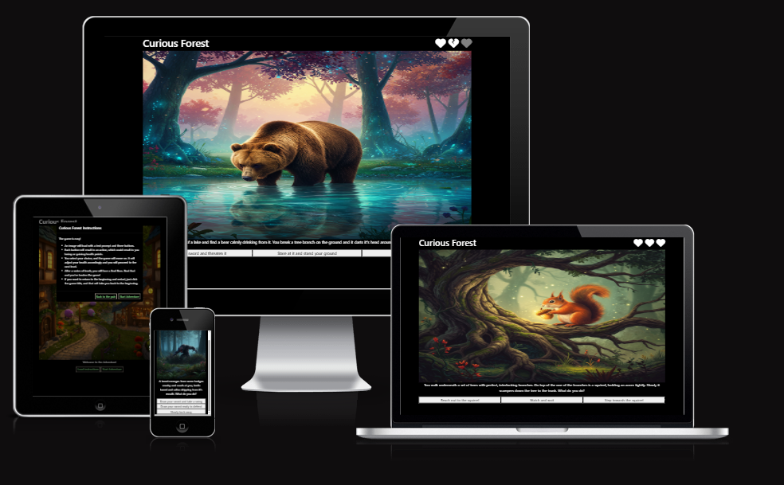

Welcome to the README for the Curious Forest choose your own adventure game site.

Visit the deployed site: [Curious Forest](https://liambaker93.github.io/curious-forest/)

JavaScript was an interesting language to start getting involved with and learning, so I wanted to do a project that would give me plenty of opportunities to gain further understandings of what JS is capable of and how to use it efficiently. 

## Table of Contents
1. [Rationale](#rationale)
2. [User Stories](#user-stories)
3. [Wireframes](#wireframes)
    - [Desktop Wireframes](#desktop-wireframes)
    - [Mobile Wireframes](#mobile-wireframes)
4. [Styling](#styling)
5. [Testing](#Testing)
    - [Code Validation](#code-validation)
    - [Bugs Found](#bugs-found)
    - [Script Tests](#script-tests)
6. [Deployment & Local Development](#deployment--local-development)
    - [Deployment](#deployment)
    - [Local Development](#local-development)
7. [References](#references)
    - [Education Tools](#education-tools)
    - [Design Tools](#design-tools)
    - [Images](#images)

## Rationale

This project is designed to help further my understanding of JavaScript as a language, trying to lightly incorporate different functionalities to try and pull together a seamless experience for the user. 

Having the different kinds of story 'cards' as I've referred to them throughout the code, and having them pulled with a degree of randomness was important for me to understand how to implement, as it solved the first user story easily. If the cards being displayed to the user are random, then this will create a different user experience. 

However, I aim for this game to be developed by me the more I learn and the more ideas for cards I have, so I needed to create a system that easily allowed for later additions. 

I aim for this to also not involve AI art at some point. Gemini has been very useful in helping me create the art for the game currently, however I view these as placeholders to give the site some flavour while I wait to get some actual art drawn up and included.

## User Stories

- "I like to play games, and want the option to have a different experience each time I play."

- "I don't play many games, so want an easy to understand game that doesn't require many rules to get into."

## Wireframes

### Desktop Wireframes

Beginning the wireframing I knew I wanted a very simplistic page, with just an image, starting text and the 'Start Adventure' button. 

I wanted the image to take up most of the page to draw the user's attention to the centre of the page.

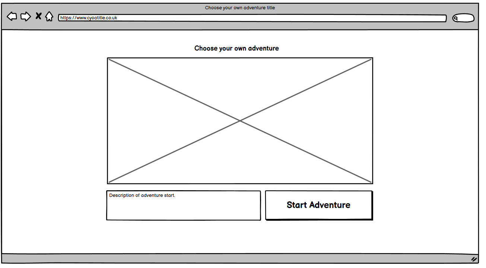

When the user clicks the start adventure button, I wanted the page to change to display a new image, new text and new button options.

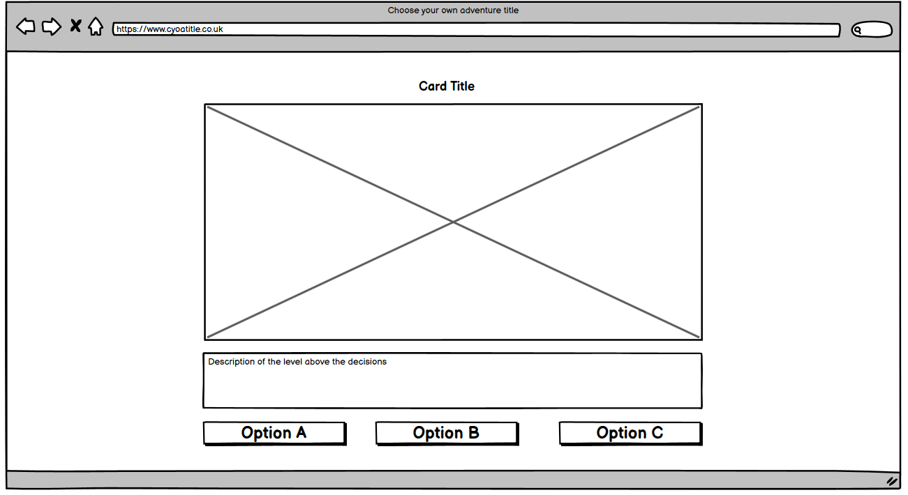

### Mobile Wireframes

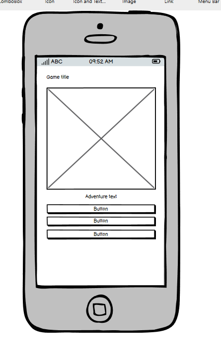

The phone layout I wanted to be readable with minimal scrolling. So wanted the image to fit within the viewport of the device, and then have the buttons below it.

## Styling

For this project, I wanted to keep the site simple and plain in terms of styles.

I incorporated Bootstrap mainly to help with the layout of the site and to keep the images and the buttons uniform and neat.

The main piece of styling that evolved throughout the project was how to display the Hearts on the top of the page to the player. I used Font Awesome to find the hearts I wanted and then built them into the page. They then needed to only display when the game actually starts, and appear along the top of the image parallel to the game title. 

This is how the full health bar displays to the player. Each heart represents two points of health, as the game state begins with the player having 6 points of health. Instead of having 6 hearts, Font Awesome had a cracked heart element which I used to display the interim health points.

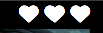

This is how 5 points of health looks to the player.

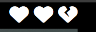

Initially I had styled the hearts to be hidden from the player when they had lost a heart's worth of health. However, while testing the game amongst some friends, one had commented that actually it may be better to make the heart faded rather than gone entirely. 

I took this on board, and adjusted it from being hidden, to creating a new CSS class to turn the opacity down. 

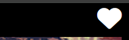

I used JS to then add this class on to the hearts when the health conditions have been met, which looks more obvious to the player what has happened to their health, and also was actually quite useful when it came to testing the scripting as I felt it gave me a better indication as to what was happening.

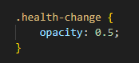

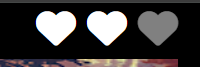

## Testing

Go to [TESTING.md](./readme-files/TESTING.md) for all the testing I completed.

### Code Validation

#### HTML Validation

The HTML validation came up with a few warnings about redundant closing tags which I cleared and then I had used < p > tags on either side of the list within the instructions modal, which it deemed irrelevant so I also deleted those. 

One warning it came up with was about a closing H1 tag. I had initially used two H1 tags for both the title of the game and the health icons. I then cleaned this up, used a span within the H1 to house the health and then styled with CSS to push the health to where I wanted them to go.

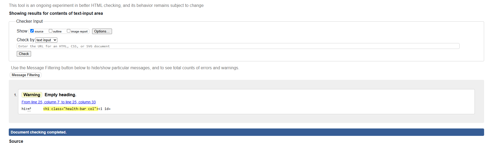

After fixing it I had no errors show on the validation.

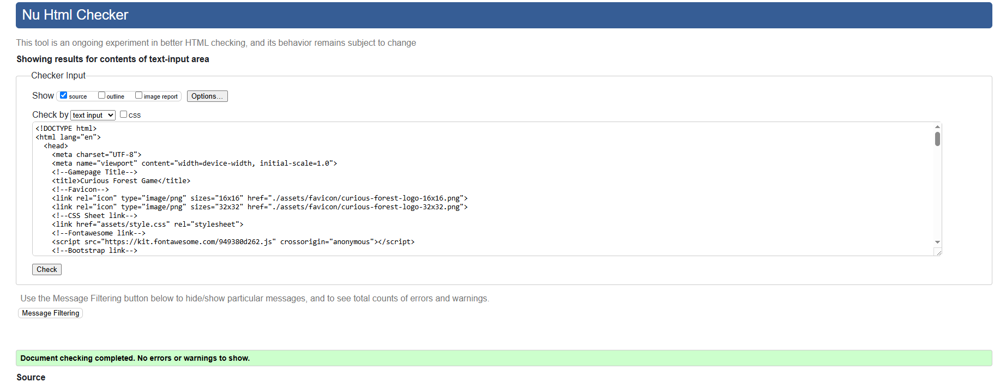

#### CSS Validation

The CSS validated first time with no issues present

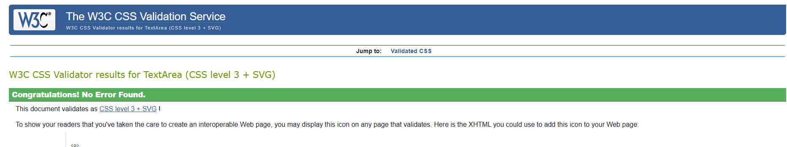

### Bugs Found

| No | Bug | Solution
| -- | ---- | ------ |
| 1 | The health was adjusting after the following level card had been displayed | This was due to the checkHealth function being run at the start of the nextLevel function as opposed to directly after the buttons have been pressed leading to the displayText function. I moved the checkHealth function to be called at the end of displayText  and before the next level has been generated which then fixed the issue. |
| 2 | The modal for submitting the user reads the instructions wasn't closing after starting the game | This was an easy fix, I added a button to that modal that would close the Modal when clicked. Then within my JS function handling the form validation, if the validation worked and the game can be started, I programmatically have that button clicked to close the modal. |
| 3 | The health wasn't adjusting by the amount I had scripted it to at certain instances. | This was due to the event listeners for the buttons being housed within the main level function. So what I had understood through searching online was that retaining the listeners inside the function would then loop their use each time causing unpredictable results. Moving that outside of the function and into the global scope then meant that they were acting more independently each time which fixed the issue. |

## Deployment & Local Development

### Deployment

The site has been deployed using GitHub Pages - [Curious Forest]

To deploy the site using GitHub Pages:

1. Login or signup to [GitHub](https://github.com/)
2. Follow the link to the repository for this project: [liambaker93/curious-forest](https://github.com/liambaker93/curious-forest)
3. Click the settings button
4. Select pages from the navigation menu on the left side
5. Using the source dropdown, select main branch and press Save.
6. The site is now being deployed, note that it may take a few minutes before the site goes live.

### Local Development

#### How to Fork

To fork the repository:

1. Login or signup to [GitHub](https://github.com/)
2. Follow the link to the repository for this project: [liambaker93/curious-forest](https://github.com/liambaker93/curious-forest)
3. Click the Fork button above the about section.

#### How to Clone

To clone the repository:

1. Login or signup to [GitHub](https://github.com/)
2. Follow the link to the repository for this project: [liambaker93/curious-forest](https://github.com/liambaker93/curious-forest)
3. Click the green code button under the title bar
4. Select whether you want to clone using HTML, SSH or GitHub CLI and click the copy button next to the URL
5. Open the terminal in your code editor and change the current directory to the location you'll use for the cloned directory
6. Type 'git clone' into the terminal, paste the link and press enter.

## References

Thanks again to my mentor Jubril who was able to really push me along with my understanding of quite a few priniciples of JavaScript which I took through to the rest of the project.

And thanks to Jess, our course leader, for helping to keep me on track throughout the project and ensure I'm sticking to specific requirements !

### Education Tools

[Bootstrap was key in keeping the site responsive across device sizes as well as making it look neat. Especially useful for putting the Modals together.](https://getbootstrap.com/docs/5.3/components/modal/)

[w3schools was helpful for me to try and understand a lot of the rudimentary JS syntax and logic ideas. Specifically useful for understanding the form validation](https://www.w3schools.com/js/js_validation.asp)

[While this page specifically didn't directly help me solve any problems, Stack Overflow was a really useful tool in seeing how other people had encountered similar problems which enabled me to adapt the solutions to fit how what I needed from them](https://stackoverflow.com/questions/21212426/bootstrap-modal-form-closing-before-validation)

I also made use of AI tools like Google's Gemini to help me understand different concepts of JavaScript, utilising the sources it provides to then go to the forum/tutorial pages that it lifted from to figure out more of an understanding of where I was going wrong or maybe misunderstanding something.

### Images

All of the images for this project were generated using Google Gemini.
